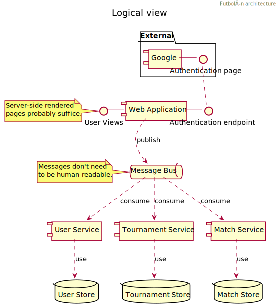

# Futbolín Architecture

## Context
Futbolín is primarily a playground and a place of experimentation.
As a consequence, some choices or combinations may not seem obvious or logical.
Nevertheless, this document tries to give some insight in why I made those choices. 

## Logical Architecture
The logical architecture is separated into the various domains of organising a football competition.
We can see _matches_, _tournaments_ and of course _users_.
The _users_ could also have been named _players_, which might have made more sense in the context of a football competition.
Since all _players_ are also _users_, but not all _users_ are necessarily _players_, I decided to stick with _users_.

The domain logic is positioned in the _Services_, and they all have their corresponding _Store_ for persistent storage.
The user-facing web application does not interact with the _Stores_ directly, nor with the _Services_.
All components are decoupled at runtime using a _Message Bus_.
It is not strictly necessary for this kind of application, but I liked the approach anyway.
Since messages on the bus are not used by humans, there is no requirement to be able to _read_ those messages for humans either.

## Technical Architecture
In general, all components are implemented with Java 11.
All components are deployed inside a Kubernetes cluster.
Some of them (e.g. the Nginx webserver or RabbitMQ message bus) are deployed from a [Helm chart](https://helm.sh/).
Details on setting up a local or production environment can be found in the [deployment directory](../deployment).

### Message Bus
| | |
| --- | --- |
| *Selected product* | RabbitMQ |
| *Deployment configuration* | High-available cluster. |

I really like the idea of runtime decoupling and have used [RabbitMQ](https://www.rabbitmq.com/) in earlier projects.
Based on those experiences, I decided it would nice to use it in a pet project as well.

### Web Application
| | |
| --- | --- |
| *Main frameworks* | Java EE 8 with [JSR-371 (Eclipse Krazo)](https://www.mvc-spec.org/) |
| *Application server* | OpenLiberty (latest version) |
| *Integration* | Messages sent to the Message Bus using JMS specification. |

I [have previously explored](https://maarten.mulders.it/2018/09/a-first-look-at-mvc-1.0/) [JSR-371](https://www.mvc-spec.org/) with the reference implementation [Eclipse Krazo](https://www.mvc-spec.org/krazo/).
Since I wanted to build a more serious application than just the ubiquitous "Hello, World!" I decided to employ it for Futbolín as well.